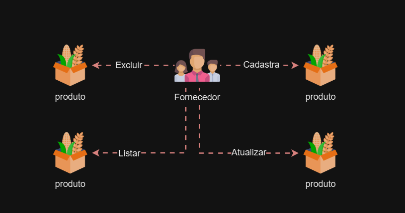
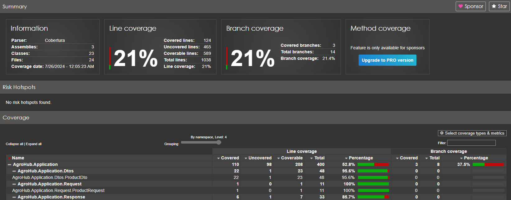

# Tech Challenge Bonus - Agro Hub

# Introdução

O Tech Challenge Bonus desta fase será desenvolver um aplicativo utilizando a plataforma .Net 8 para cadastro de produtos agrícolas, considerando a persistência de dados e a qualidade do software.

# Estudo de caso

A AgriHub é uma empresa dedicada ao comércio agrícola, oferecendo uma plataforma de marketplace inovadora que conecta produtores rurais, distribuidores e consumidores. Nossa missão é facilitar a compra e venda de produtos agrícolas, garantindo transparência, eficiência e sustentabilidade em todas as etapas da cadeia de suprimentos. Na AgriHub, trabalhamos para promover o desenvolvimento do setor agrícola, oferecendo soluções tecnológicas que simplificam a logística, aumentam a visibilidade dos produtores e asseguram a qualidade dos produtos desde a colheita até a mesa do consumidor.

# Domain StoryTelling

Para esclarecimento foi desenvolvido o domain storytelling. Esse vai ser o fluxo da solução.



# Endpoints

- POST /api/v1/product/create
    - Adiciona de novos produtos agrículas.
- GET /api/v1/product/list-all e /api/v1/product/list-by-filter
    - Consultar produtos.
    - Possibilidade de consultar por filtro.
    - Possui paginação.
- PUT /api/v1/product/update
    - Atualização de produto agrícula
- DELETE /api/v1/product/delete
    - Exclusão de produto agrícula
- GET/api/v1/Authentication/generate-qrcode
    - Geração do QR Code para Autenticação por meio 2FA.
- DELETE /api/v1/Authentication/validate-qrcode
    - Faz a validação do código fornecido.

# Tecnologias Utilizadas:

- **.NET 8**: Framework para construção da Minimal API.
- **C#**: Linguagem de programação usada no desenvolvimento do projeto.
- **Entity Framework**: ORM (Object-Relational Mapping) utilizado para interagir com o banco de dados.
- **xUnit**: Framework de testes utilizado para realizar testes unitários.
- **SQL Server**: Banco de dados relacional usado para armazenar os dados da aplicação.

# Teste de Unidade

Foram adicionados testes de unidades nas principais classes.



# Banco de Dados

Para persistência dos dados foi criado duas tabelas, a saber:

```sql
/*
Autor:Jefferson Santos

Data de Criação: 07/07/2024

Propósito:
Este script é destinado a simplificar o acesso a informações sobre contatos.

*/

// Tabela para armazenar os produtos
CREATE TABLE TB_Product (
    id_product INT PRIMARY KEY,
    name VARCHAR(100) NOT NULL,
    description VARCHAR(300),
    create_date DATETIME DEFAULT CURRENT_TIMESTAMP,
    last_update DATETIME,
    image VARCHAR(200),
    value DECIMAL(10, 2),
    quantity INT,
    unit VARCHAR(20),
    fk_category INT,
    FOREIGN KEY (fk_category) REFERENCES Tb_Category(id_Category)
);

// Tabela para armazenar as categorias
CREATE TABLE Tb_Category (
    id_Category INT PRIMARY KEY,
    name VARCHAR(100) NOT NULL
);
```

Este comando cria uma nova migração baseada nas alterações feitas no modelo de dados.

```
Add-Migration NomeDaMigracao
```

Este comando aplica todas as migrações pendentes ao banco de dados.

```
Update-Database
```

# Documentação

- [Documentação da API](https://horse-neon-79c.notion.site/Documenta-o-da-API-04183b890d7c47cb89af4445d01d6678?pvs=4)
- [Documentação de Estilo para C#](https://horse-neon-79c.notion.site/Documenta-o-de-Estilo-para-C-de62b229fd01436a96f7a090b4d11e27?pvs=4)
- [Documentação dos Testes](https://horse-neon-79c.notion.site/Documenta-o-dos-Testes-a402a32a16a24b1b925dab83201e7d19?pvs=4)
- [Documentação de Banco de Dados](https://horse-neon-79c.notion.site/Documenta-o-de-Banco-de-Dados-6ba60c4c8533491a9d28da71f6b57c93?pvs=4)
- [Guia de Estrutura do Projeto](https://horse-neon-79c.notion.site/Guia-de-Estrutura-do-Projeto-fbfbc24c616d456bb56306cfda2c0bc9?pvs=4)

# **Checklist de Conclusão de Tarefas**

- [x]  Manter Produto.
- [x]  Documentação da Api.
- [x]  Versionamento da Api.
- [x]  Monitoramento por meio de Logging.
- [x]  Middlewares
- [x]  Validação dos Dados.
- [x]  Tratamento de Erros.
- [x]  Persistência com EF.
- [x]  Segurança na Api.
- [x]  Testes de unidade.
- [x]  Autenticação 2FA
- [x]  Injeção de Dependência
- [x]  Paginação
